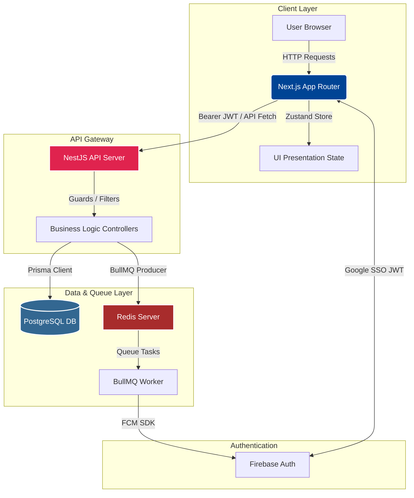

# CuriousBees Architecture Guide

This document provides a comprehensive technical overview of the **CuriousBees V2** platform architecture.

---

## 1. System Topology

CuriousBees utilizes a decoupled, strictly typed client-server architecture. The frontend application handles presentation, client state, and route-level protection, while the backend API handles database transactions, authorization checks, and background messaging queues.

---

## 2. Frontend Architecture (`apps/web`)

* **Framework**: Next.js 15+ utilizing React 19 (Server Components + Client Components mix).
* **State Management**: Zustand handles global UI caching and session persistence (`apps/web/src/store/useStore.ts`). API responses are selectively cached using React Query.
* **API Communications**: Outgoing requests utilize a unified client wrapper `apiFetch` which intercepts calls to attach authorization headers automatically.
* **Design Token Integration**: Theme values and components are consolidated under `packages/ui` and styled using Tailwind CSS utility classes.

---

## 3. Backend Architecture (`apps/api`)

* **Framework**: NestJS 11+ configured with modular architecture.
* **Dependency Injection**: Business logic is separated into independent domain modules (e.g. `UsersModule`, `WorkspacesModule`, `OpportunitiesModule`).
* **Validation**: Request payloads are filtered through a global `ValidationPipe` using TypeScript DTO classes with `class-validator` decorator validations.
* **Exception Layer**: Standardized NestJS exception filters catch and transform operational errors into uniform JSON payloads (e.g., `{ message, statusCode, timestamp }`).

---

## 4. Database Schema (`apps/api/prisma`)

CuriousBees runs PostgreSQL managed via Prisma ORM.

### Key Database Relationships
* **`User`**: Identifies researchers, guides, and admins. Stores profiles, supervisor references, and approval flags.
* **`Workspace`**: Isolated collaboration environment containing Announcements (`WorkspaceAnnouncement`), Files (`WorkspaceFile`), and Milestones (`WorkspaceMilestone`). Users are mapped to Workspaces using a `WorkspaceMember` junction table.
* **`Thread` & `Comment`**: Discussion forum structures with cascading delete triggers.
* **`Opportunity` & `CollaborationRequest`**: Opportunities created by supervisors can receive requests from scholars, managed via statuses.

---

## 5. Role-Based Access Control (RBAC)

Access control operates on two layers:
1. **Edge Router Protection (Next.js Middleware)**: Validates client cookie `cb-role` against allowed routes specified in permissions configuration. Blocks unauthorized access before page render.
2. **API Endpoint Guards (NestJS)**: Enforces token checks via `@UseGuards(FirebaseAuthGuard)`. Specific operations are wrapped in role-specific decorators to protect mutations.

---

## 6. Background Queue & Notifications

To avoid blocking thread loops during heavy push notification requests:
1. An action (like a new supervision request) registers.
2. The `NotificationsService` puts a background job payload into BullMQ.
3. The server immediately resolves the user request.
4. A dedicated background NestJS thread (`NotificationProcessor`) consumes the job from Redis and contacts Firebase Cloud Messaging (FCM) to trigger alerts.

---

## 7. Local Development Mode Override

For fast prototyping and development without internet or cloud setups, enabling `DEVELOPMENT_MODE` bypasses several authentication layers:
* **Token Bypass**: `api-client.ts` returns a mock token instantly, preventing Firebase loading hangs.
* **State Short-circuit**: Zustand's `syncUserSession` directly loads a local mock developer profile.
* **API Access**: NestJS guards accept mock bypass tokens, resolving a local developer user with the role specified in `localStorage`.
* **Dev Switcher Widget**: A floating controls panel at the bottom right allows on-the-fly switching between `RESEARCH_SCHOLAR`, `RESEARCH_SUPERVISOR`, and `INSTITUTION_ADMIN` roles for visual testing.
