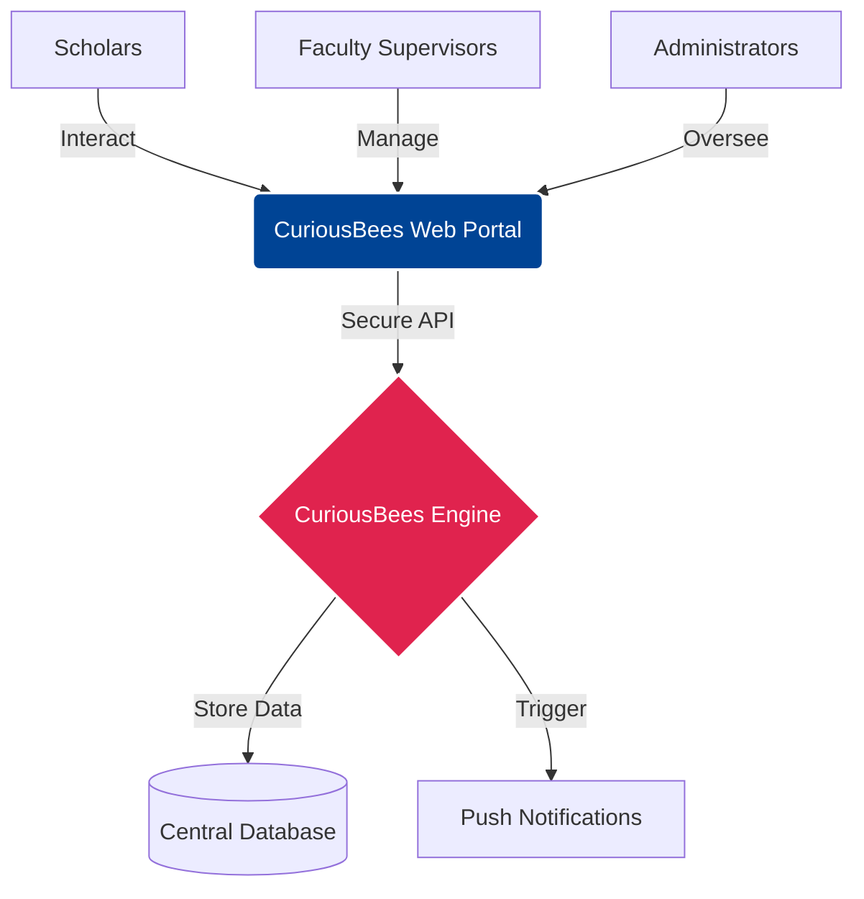

# CuriousBees V2: Project Overview

This document provides a high-level, non-technical summary of CuriousBees V2, tailored for University Officials, Faculty Members, and Project Sponsors.

---

## What is CuriousBees?

CuriousBees is a centralized, digital Research Collaboration Platform designed specifically for modern university ecosystems. It replaces fragmented communication tools (like endless email chains, generic messaging apps, and scattered file storage) with a unified environment dedicated solely to academic research, supervision, and institutional collaboration.

## Why it Exists & Problems it Solves

In large educational institutions, research happens in silos. 
- **Problem 1:** Scholars struggle to find faculty members who have the time, matching interests, and capacity to supervise their research.
- **Problem 2:** Faculty members are overwhelmed by informal requests for supervision and lack a central dashboard to track the progress of their existing scholars.
- **Problem 3:** Researchers in different departments often work on similar problems without knowing it, missing valuable opportunities for cross-disciplinary collaboration.

**CuriousBees solves these problems by providing:**
1. A structured approval workflow connecting scholars to supervisors.
2. A unified dashboard for tracking research progress and milestones.
3. An "Opportunities Board" and "Discussion Threads" to foster institution-wide networking.

---

## Who Uses CuriousBees?

The platform supports three distinct roles, each with a tailored experience:

### 1. Research Scholars (Students / Researchers)
**Their Journey:**
- A scholar signs in securely using their University Google account.
- Upon first login, they are prompted to browse the faculty directory and send a formal "Supervision Request" to a Faculty Member.
- Once approved, they gain full access to the platform.
- They can browse the Opportunities board to apply for research grants or open positions on larger projects.
- They can join dedicated "Workspaces" created by their supervisors to upload research drafts, track due dates (milestones), and collaborate with peers.

### 2. Research Supervisors (Faculty Members)
**Their Journey:**
- A faculty member logs into their specialized Supervisor Dashboard.
- They receive instant notifications when a scholar requests their supervision.
- They can review the scholar's profile and choose to "Approve" or "Decline" the request with a single click.
- They can create "Workspaces" for their active projects, inviting multiple scholars to collaborate.
- They can post to the "Opportunities Board" when looking to recruit specialized students (e.g., "Seeking Data Science Scholar for Bioinformatics Project").

### 3. Institutional Administrators (University Officials)
**Their Journey:**
- Administrators have access to a bird’s-eye view of the platform.
- They can manage user roles (e.g., upgrading a new faculty member from Scholar to Supervisor).
- They monitor global platform usage to ensure adherence to university guidelines.

---

## Major Features

1. **Role-Based Dashboards:** Unique home screens that surface exactly what the user needs to see (e.g., Approval Queues for Supervisors, Upcoming Deadlines for Scholars).
2. **Workspaces:** Secure, private groups for specific research projects where members can share files and post announcements.
3. **Opportunities Board:** A digital bulletin board for research recruitment and collaboration requests.
4. **Discussion Threads:** A forum for academic discourse, allowing researchers to ask questions and share findings globally across the university.
5. **Real-Time Notifications:** Push notifications that ensure users never miss an urgent supervision request or important workspace deadline.

---

## Benefits to the University

- **Increased Collaboration:** Breaks down departmental silos, encouraging cross-disciplinary research.
- **Administrative Efficiency:** Standardizes the process of assigning students to faculty guides.
- **Talent Discovery:** Helps faculty easily identify and recruit promising scholars for complex projects.
- **Institutional Prestige:** A modern, bespoke platform demonstrates a commitment to technological advancement and research excellence.

---

## Simple Architecture Diagram

---

## Future Expansion

While CuriousBees currently serves as a highly effective web platform, the roadmap includes:
1. **Native Mobile Applications:** For on-the-go access to notifications and quick approvals.
2. **Active Directory Integration:** Deeper integration with specific university email domains for automatic faculty recognition.
3. **Institutional Analytics:** Comprehensive reporting for administrators to track university-wide research output over time.
