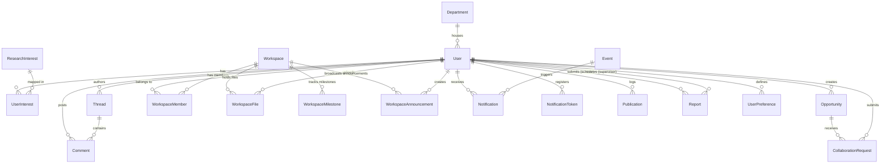

# CuriousBees V2 — Database Architecture Documentation

This document describes the database design, entity relationships, indexing optimizations, connection pooling settings, and backup strategies for the **CuriousBees V2** PostgreSQL database (hosted on Supabase).

---

## 📊 1. Entity-Relationship (ER) Diagram

The relationships between core database entities are mapped in the following diagram:



---

## 🗺️ 2. Data Models and Relationships

The database is built around three user roles: **Research Scholars**, **Research Supervisors (Faculty)**, and **Institution Administrators**.

### 2.1 Core Entities

#### 1. User
* **Purpose**: Primary identity table storing name, email, credentials, and verification status.
* **Relations**:
  * Self-relation `supervisorId` $\rightarrow$ `User` (Links PhD scholars to their faculty supervisors).
  * `departmentId` $\rightarrow$ `Department` (Associates profiles with university departments).

#### 2. Department
* **Purpose**: Lists university branches (e.g., Computing Technologies, Biotechnology, ECE).
* **Relations**: Unique constraint on `name` and `code`.

#### 3. Workspace, WorkspaceMember, WorkspaceFile, WorkspaceMilestone, WorkspaceAnnouncement
* **Purpose**: Collaborative sandboxes created when scholars and supervisors engage in a project.
* **Relations**:
  * `WorkspaceMember` is a junction table with a composite primary key `(workspaceId, userId)`.
  * `WorkspaceFile` tracks file path URLs and upload metadata.

#### 4. Opportunity & CollaborationRequest
* **Purpose**: Academic job boards. Supervisors post openings; scholars apply.
* **Relations**: Unique index on `(scholarId, opportunityId)` preventing duplicate submissions.

#### 5. Thread & Comment
* **Purpose**: Discussion forums where researchers communicate.

#### 6. Publication & Report
* **Purpose**: Progress tracking. Scholars log journals/milestones; supervisors submit audits and feedback.

---

## ⚡ 3. Indexing Strategy

By default, PostgreSQL does **not** create indexes on foreign keys. When executing relational joins (e.g., fetching a user's publications or listing workspace files), Postgres must perform a full table scan. 

We audited the schema and implemented explicit indexes (`@@index`) in [schema.prisma](file:///Users/maddy/Current%20Project/CuriousBees_V2/apps/api/prisma/schema.prisma) on the following critical foreign keys:

| Model | Indexed Column(s) | Optimized Query Pattern |
| :--- | :--- | :--- |
| **`User`** | `departmentId`, `supervisorId` | Joins connecting departments or supervisors to scholars. |
| **`Thread`** | `authorId` | Loading all discussion threads authored by a specific user. |
| **`Comment`** | `threadId`, `authorId` | Rendering feed comments on discussion routes. |
| **`Opportunity`**| `authorId` | Listing active postings by a specific supervisor. |
| **`Notification`**| `userId`, `eventId` | Polling user notification feeds. |
| **`WorkspaceMember`**| `userId` | Finding all workspaces a user belongs to. |
| **`WorkspaceFile`**| `workspaceId`, `uploadedById` | Listing files within a research sandbox. |
| **`WorkspaceMilestone`**| `workspaceId` | Rendering milestone deadlines on gantt/calendar widgets. |
| **`WorkspaceAnnouncement`**| `workspaceId`, `authorId` | Loading announcements inside a workspace. |
| **`Publication`**| `userId` | Querying a scholar's CV and research profile. |
| **`Report`** | `scholarId`, `supervisorId` | Loading approval queues for reports. |

---

## 📡 4. Connection Management & Pooling

When deploying NestJS (which is a persistent Node.js process) to serverless hosting (like Vercel) or containerized services (like Railway), the number of concurrent database connections can grow rapidly and exhaust Postgres resources.

### 4.1 Configuration Matrix

We separate connections inside our configuration files:
1. **Transaction Pooling (Port 6543 / PgBouncer)**:
   * **Target**: `DATABASE_URL`
   * **Usage**: Set in NestJS app boot files. It allows thousands of virtual connections by reusing server-side database connections on every transaction query.
2. **Direct Connection (Port 5432 / Direct Access)**:
   * **Target**: `DIRECT_URL`
   * **Usage**: Used strictly by Prisma migrations CLI (`npx prisma migrate deploy`). Migrations require session locks and DDL queries, which are incompatible with PgBouncer Transaction Mode.

---

## 💾 5. Database Backup Strategy

To ensure zero-data-loss compliance in production, we recommend the following backup setup:

### 5.1 Automated Managed Backups (Supabase)
* **Daily Backups**: Supabase automatically performs daily physical backups of the database.
* **Point-in-Time Recovery (PITR)**: Enable PITR (available on Supabase Pro) to roll back database transactions to any specific second (e.g. recovering from accidental database wipes).

### 5.2 Automated Logical Backups (CLI/Cron)
For secondary offsite backups, configure a recurring Cron job (e.g. GitHub Actions cron or local server cron) running `pg_dump`:

```bash
# Export schema and data as a compressed SQL file
pg_dump -h db.your-supabase-id.supabase.co -U postgres -d postgres -F c -b -v -f backup_file.dump
```
