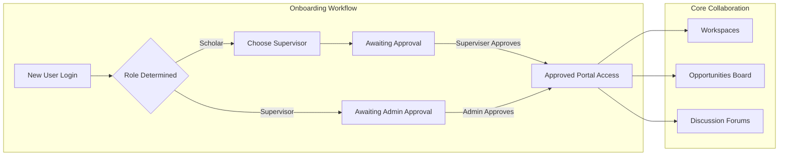

# CuriousBees V2 — Project Overview

CuriousBees is a centralized, digital Research Collaboration Platform designed specifically for modern university ecosystems. It replaces fragmented communication channels (such as emails, external chats, and shared drives) with a unified environment dedicated to academic supervision, project tracking, and research discovery.

---

## 👥 User Personas & Journeys

### 1. Research Scholars (PhD / Researchers)
* **Onboarding & Approval**: New scholars register using their university accounts. They are required to search the supervisor directory and request supervision. Once approved, the dashboard unlocks.
* **Collaboration**: Scholars can search for active project recruitments on the Opportunities board, participate in cross-disciplinary Discussion Threads, and share documents inside Workspaces.
* **Progress Tracking**: Scholars post periodic progress updates and report milestones directly to their advisors.

### 2. Research Supervisors (Faculty Members)
* **Advisor Management**: Supervisors receive requests from scholars, reviewing their profiles and credentials before granting formal approval.
* **Workspaces**: Supervisors create workspaces for their active research grants, inviting their approved scholars to collaborate, assign deadlines, and review research drafts.
* **Recruitment**: Supervisors post open research slots or scholar assistant positions to the Opportunities board to discover talent from other departments.

### 3. Institutional Administrators (University Officials)
* **System Governance**: Admins maintain a bird's-eye view of all platform activity. They can promote users to supervisors, verify credential status, and manage global department lists.
* **Platform Security**: Admins monitor audit logs and ensure compliance with university research standards.

---

## 🛠️ System Modules & Workflows

### 1. Workspaces
Dedicated rooms where members share files and post announcements. Features:
* **Documents Area**: Secure files repository with size and type metadata.
* **Project Milestones**: Progress checklist (e.g. thesis draft submission deadlines).

### 2. Opportunities Board
A dashboard where supervisors and scholars post project listings. Features:
* **Collaboration Requests**: Scholars submit applications explaining their qualifications.
* **Applications Management**: Owners accept or reject requests.

### 3. Discussion Forums (Threads)
A global discussion board for university-wide academic discussions. Features:
* **Topic Tagging**: Organizes discussions by domain (e.g. "Generative AI", "Quantum Computing").
* **Comment Trees**: Facilitates peer review and questions.

---

## 🗺️ Product Roadmap

* **Phase 1 (Active)**: Core features (Workspaces, Opportunities, Threads) with a local development auth bypass.
* **Phase 2 (Planned)**: Native Mobile application (React Native) with real-time push alerts.
* **Phase 3 (Future)**: Deep SSO integration with specific university directory systems (e.g., Active Directory / Shibboleth).
