<div align="center">

# SRM CuriousBees

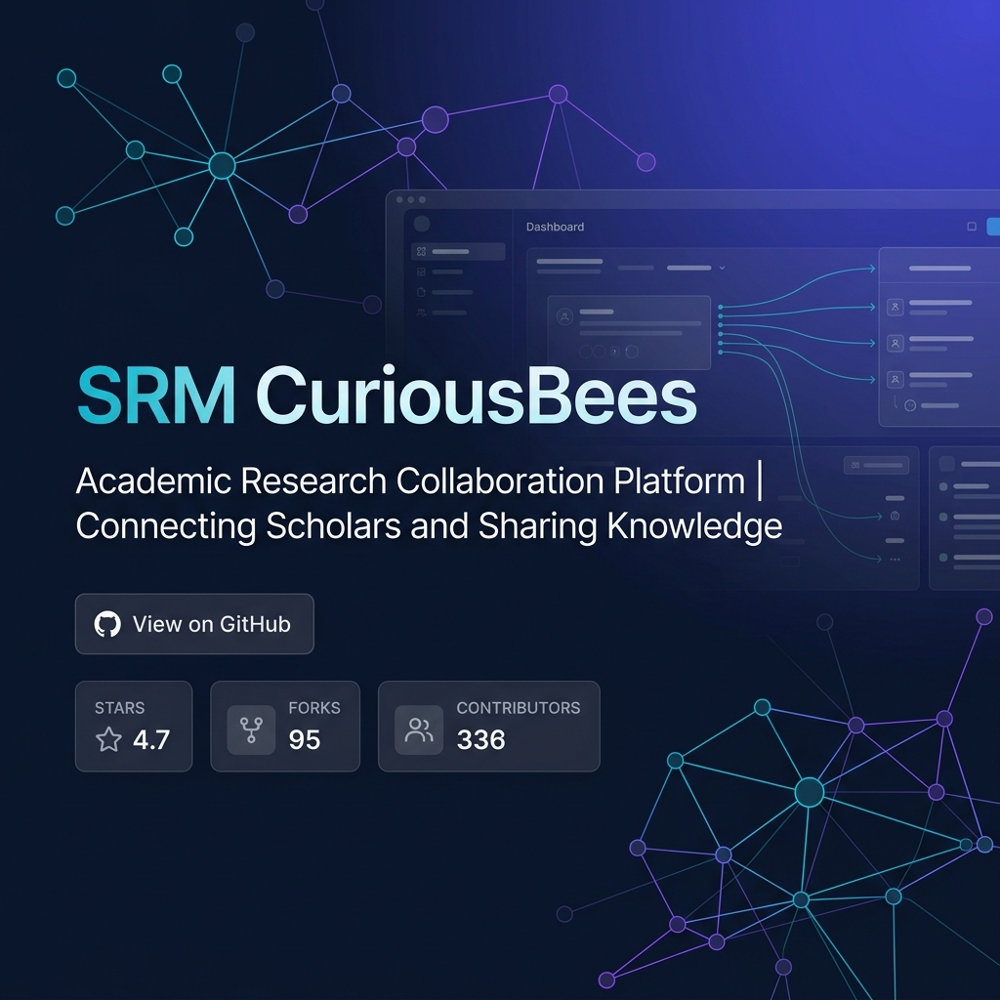

### Research Collaboration & Supervisor-Scholar Management Platform

> *Accelerating academic discovery through centralized research collaboration, opportunity management, and intelligent supervisor-scholar workflows.*

[](https://nextjs.org/)
[](https://nestjs.com/)
[](https://www.typescriptlang.org/)
[](https://www.postgresql.org/)
[](https://www.prisma.io/)
[](https://turbo.build/)
[](https://tailwindcss.com/)

[](https://opensource.org/licenses/MIT)
[](https://github.com/sudeshsudhii/SRM-CuriousBees)
[](#)
[](#)
[](#)

</div>

---

## ⚡ Quick Overview

| 🎯 The Problem | 💡 The Solution |
|-------------|--------------|
| Fragmented communication channels (email, chat, cloud drives) hamper academic progress, thesis tracking, and inter-departmental collaboration. | A unified, secure digital ecosystem centralizing academic supervision, project tracking, and research discovery. |

**Target Users:**
* 🎓 **Research Scholars:** Streamlined mentorship, milestone tracking, and cross-department collaboration.
* 👨‍🏫 **Faculty Supervisors:** Granular control over research workflows, scholar recruitment, and progress monitoring.
* 🛡️ **Institutional Administrators:** Top-down visibility, department management, and security governance.

---

## 📊 Key Metrics at a Glance

<div align="center">

| Metric | Capability |
|:---:|:---|
| 👥 **3 User Roles** | Strict isolation between Scholars, Supervisors, and Institute Admins. |
| 🛡️ **RBAC Model** | Deeply enforced Role-Based Access Control protecting research data. |
| 🧩 **Monorepo** | Highly optimized Turborepo structure sharing types and UI components. |
| 🔌 **REST APIs** | NestJS backend offering strictly validated, scalable API endpoints. |
| 🗄️ **PostgreSQL** | Relational data integrity powered by Supabase and Prisma ORM. |
| 🔐 **Clerk Auth** | Enterprise-grade Identity Management and SSO integrations. |

</div>

---

## 🗺️ Architecture Navigation

Explore the system architecture in depth:

* [🏗️ High-Level System Architecture](#1-high-level-system-architecture)
* [🔄 API Request Lifecycle (Sequence)](#6-sequence-diagram-api-request-lifecycle)
* [📦 Monorepo Component Tree](#7-component-diagram)
* [🗄️ Database ER Diagram](#9-database-er-diagram)
* [🚀 CI/CD Pipeline](#10-cicd-pipeline-diagram)

---

## 💻 Tech Stack Showcase

### Frontend
   

### Backend
  

### Database & Auth
  

### Infrastructure & DevOps
   

---

## Architecture Diagrams

Below are the comprehensive Mermaid diagrams detailing the system from various architectural perspectives.

### 1. High-Level System Architecture

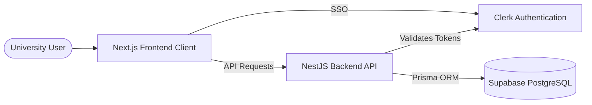

### 2. Detailed Architecture Diagram

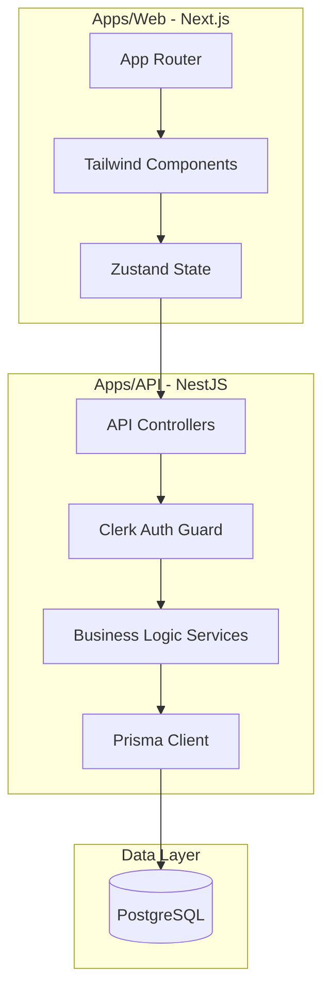

### 3. Workflow Diagram (User Journey)

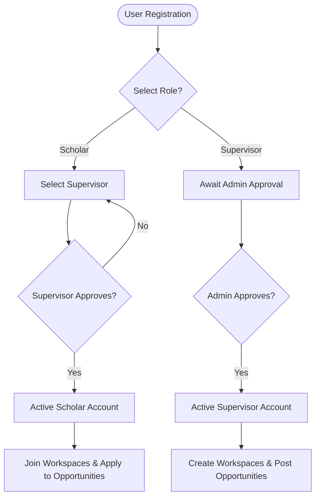

### 4. Data Flow Diagram

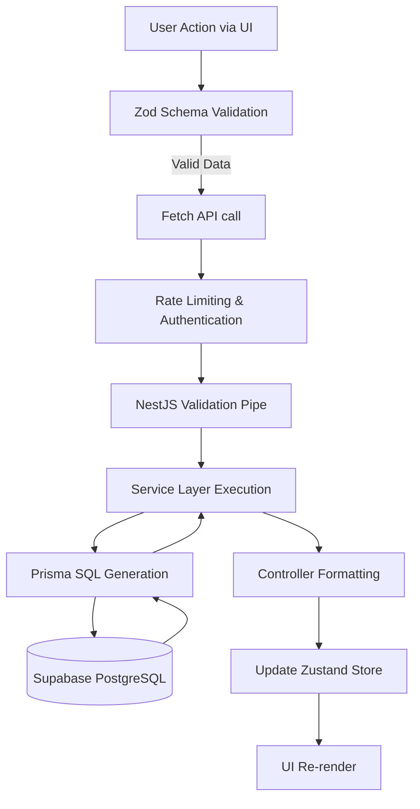

### 5. Use Case Diagram

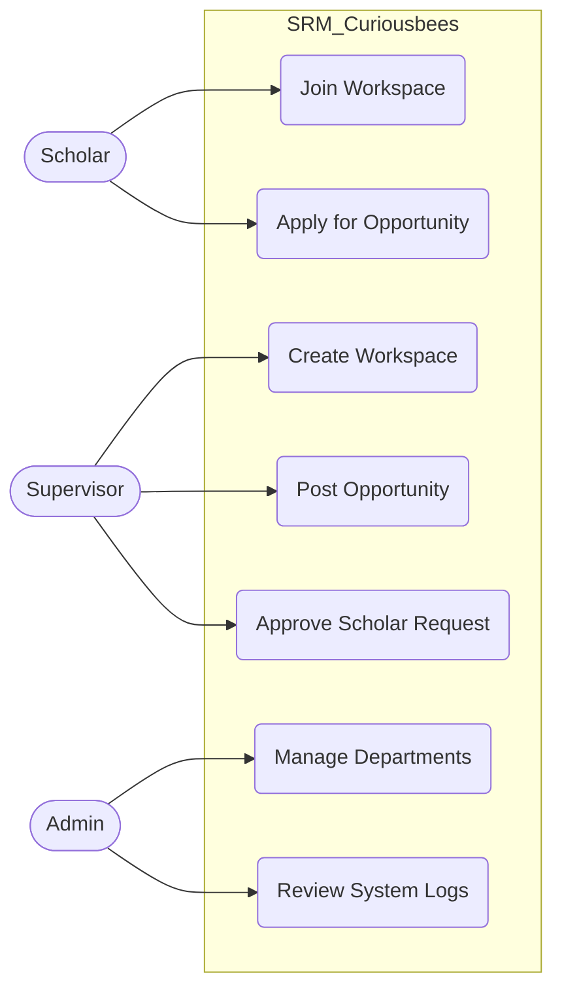

### 6. Sequence Diagram (API Request Lifecycle)

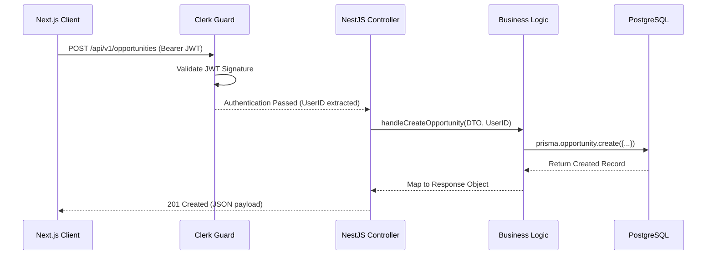

### 7. Component Diagram

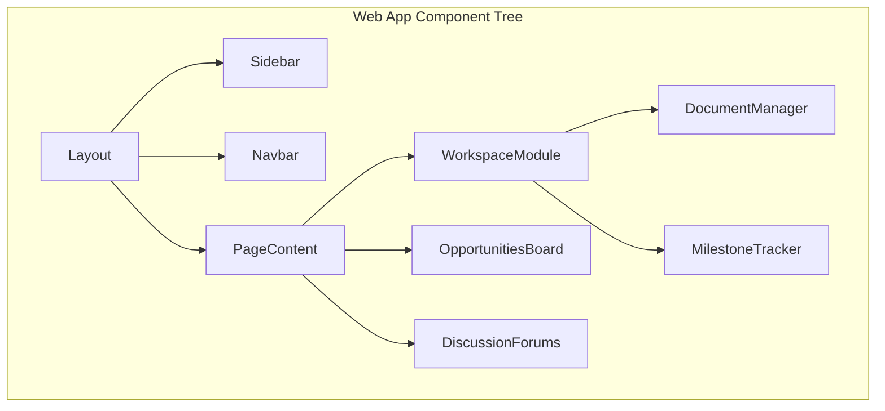

### 8. Deployment Diagram

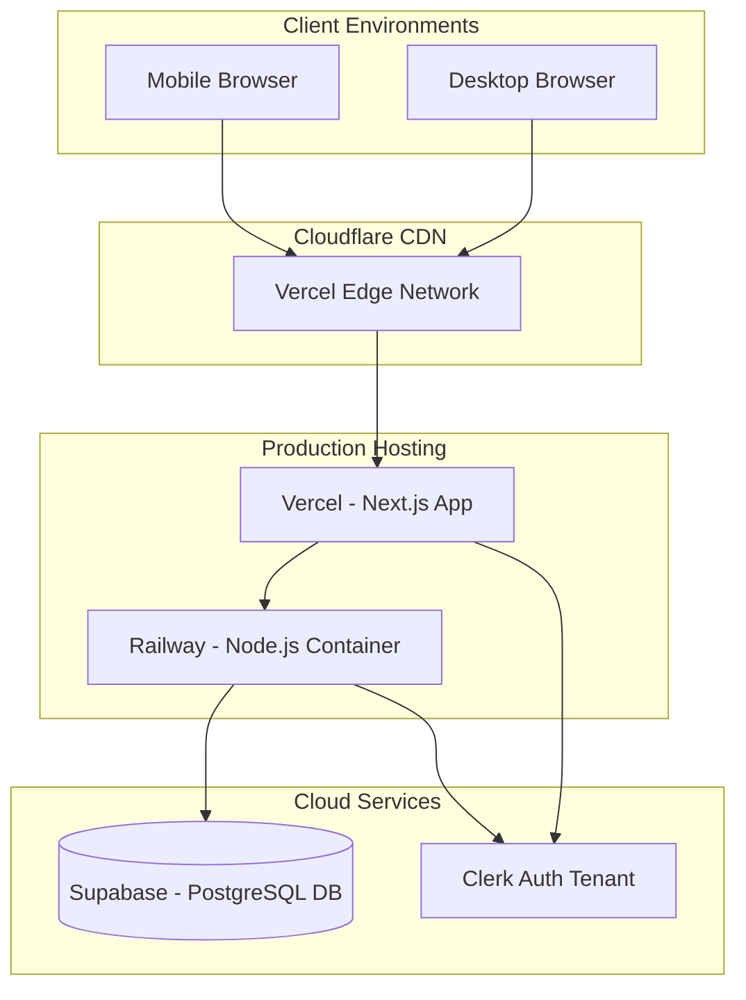

### 9. Database ER Diagram

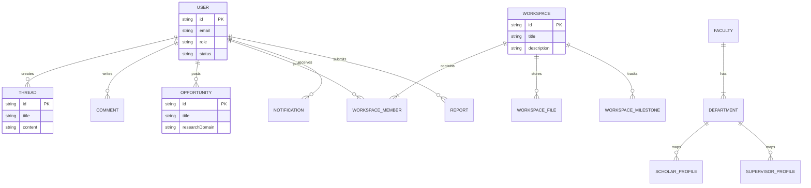

### 10. CI/CD Pipeline Diagram

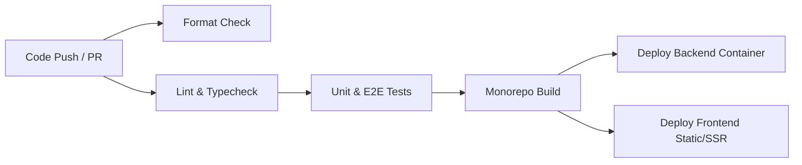

---

## Technology Stack

```text
Frontend Layer
├── Next.js (App Router)
├── React
├── TypeScript
├── Tailwind CSS
├── Zustand (State Management)
└── shadcn/ui

Backend Layer
├── NestJS
├── TypeScript
├── Prisma (ORM)
└── Zod (Validation)

Data & Auth Layer
├── PostgreSQL (Database)
├── Supabase (Hosting / Storage)
└── Clerk (Authentication)
```

---

## API Documentation

The backend exposes a structured RESTful API. Below are key modular boundaries:

| Method | Endpoint | Description | Role Required |
| ------ | -------- | ----------- | ------------- |
| `GET` | `/api/v1/users/profile` | Retrieve current user profile | Any Authenticated |
| `POST` | `/api/v1/workspaces` | Create a new research workspace | Supervisor |
| `GET` | `/api/v1/workspaces/:id` | Fetch workspace documents/milestones | Workspace Member |
| `POST` | `/api/v1/opportunities` | Post a new research listing | Supervisor |
| `POST` | `/api/v1/threads` | Create a new discussion thread | Any Authenticated |
| `POST` | `/api/v1/admin/approve` | Approve a scholar/supervisor | Institute Admin |

---

## Project Structure

```text
SRM_Curiousbees/
├── apps/
│   ├── api/                  # NestJS Backend Application
│   │   ├── prisma/           # Database schema and seeders
│   │   └── src/              # API Controllers, Services, Modules
│   └── web/                  # Next.js Frontend Application
│       ├── src/app/          # Next.js App Router Pages
│       └── src/components/   # Reusable UI Components
├── packages/
│   ├── constants/            # Shared Enums and Identifiers
│   ├── shared-utils/         # Shared Zod Schemas & Functions
│   ├── types/                # Shared TypeScript Interfaces
│   └── ui/                   # Shared UI Components (shadcn)
├── docs/                     # Architectural Documentation
├── scripts/                  # CI/CD and Maintenance Scripts
└── package.json              # Monorepo Workspace Configuration
```

---

## Getting Started

### Prerequisites
* Node.js (v18+)
* npm or pnpm
* PostgreSQL instance (or Supabase local development CLI)
* Clerk API Keys

### Installation
1. Clone the repository: `git clone https://github.com/sudeshsudhii/SRM-CuriousBees.git`
2. Install dependencies: `npm install`

### Configuration
Create `.env` files in `apps/api` and `apps/web` referencing `.env.example`.
Key variables include `DATABASE_URL`, `NEXT_PUBLIC_CLERK_PUBLISHABLE_KEY`, and `CLERK_SECRET_KEY`.

### Running Locally
Run the monorepo concurrently:
```bash
npm run dev
```
* Frontend starts at `http://localhost:3000`
* Backend API starts at `http://localhost:3001`

### Docker Setup
To run using Docker Compose:
```bash
docker-compose up --build
```

---

## Environment Variables

| Variable | Location | Description |
| -------- | -------- | ----------- |
| `DATABASE_URL` | `apps/api` | Connection string for PostgreSQL |
| `CLERK_SECRET_KEY` | `apps/api`, `apps/web` | Backend Clerk Secret |
| `NEXT_PUBLIC_CLERK_PUBLISHABLE_KEY`| `apps/web` | Frontend Clerk Key |
| `FRONTEND_URL` | `apps/api` | CORS allowed origin |

---

## Testing

* **Unit Tests**: Executed via Jest inside `apps/api` and `apps/web`. (`npm run test`)
* **Integration Tests**: E2E testing framework utilizing Supertest. (`npm run test:e2e`)

---

## Security

* **Authentication**: Token-based architecture offloaded to Clerk. JWTs are passed securely via headers and strictly validated at the API edge via Guards.
* **Authorization**: Granular Role-Based Access Control (RBAC) enforced via Prisma data isolation and Next.js middleware routing blocks.
* **Data Protection**: All API endpoints enforce strict CORS. Database connections use SSL. Input validation is rigorously handled by Zod.

---

## Performance Optimizations

* **Monorepo Caching**: Built utilizing Turborepo techniques, allowing cached builds and lighting-fast CI iterations.
* **Frontend Strategy**: Next.js App Router for aggressive server-side rendering (SSR) and React Server Components (RSC) to minimize client bundle sizes.
* **Database Pooling**: Prisma configured with optimized connection pooling directly linked to Supabase PgBouncer.

---

## Scalability Considerations

* **Horizontal Scaling**: The decoupled architecture (Next.js & NestJS) allows independent scaling of the frontend CDN network (Vercel) and the backend compute (Railway/AWS).
* **Vertical Scaling**: Database indexes have been optimized for high-read scenarios (such as Thread filtering and Opportunity matching).

---

## Future Enhancements

### Short-Term Enhancements
* Interactive real-time notifications for Thread replies and Opportunity approvals.
* Bulk CSV import for Institute Admins to onboard faculty.

### Medium-Term Enhancements
* Native Mobile application wrapper.
* Integration with university-specific LDAP/Active Directory instances.

### Long-Term Vision
* AI-powered semantic matching between Scholars and cross-departmental Opportunities.
* RAG-based chatbot trained on historical Workspace Milestones and University Guidelines.

---

## Open Source Contribution Guide

1. Fork the repository and run the setup scripts.
2. Adhere to the `CONTRIBUTING.md` branching strategy (`feature/`, `bugfix/`, `hotfix/`).
3. Ensure all Zod schemas and Prisma models remain in sync across packages.
4. Open a Pull Request referencing the Issue Template.

---

## License

This project is licensed under the [MIT License](LICENSE).
