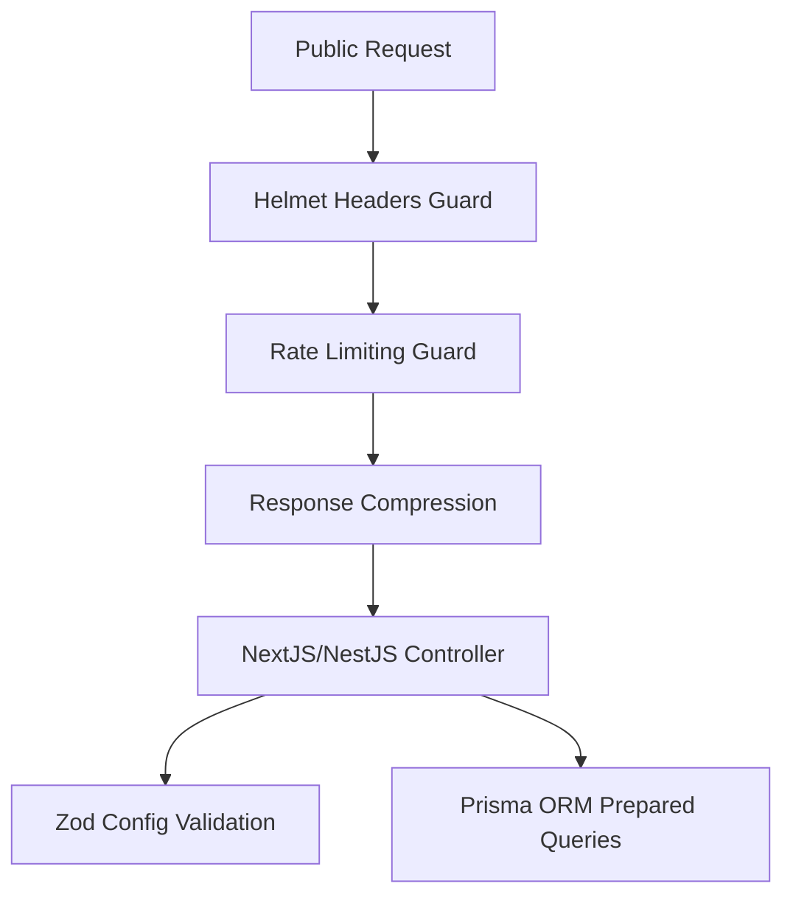

# CuriousBees V2 — Security Audit & Hardening Report

This report outlines the security measures, middlewares, rate-limiters, and sanitization layers implemented to secure CuriousBees V2.

---

## 🔒 Security Architecture Overview

---

## 1. HTTP Secure Headers (Helmet Middleware)

We integrated `helmet` in the NestJS entry point to inject industry-standard security headers:
* **HSTS (HTTP Strict Transport Security)**: Forces clients to interact using HTTPS only.
* **X-Content-Type-Options**: Blocks browsers from MIME-sniffing responses away from declared Content-Types.
* **X-Frame-Options**: Enforces `SAMEORIGIN` clickjacking protection.
* **Content Security Policy (CSP)**: Disabled dynamically in local development to allow local Swagger docs loading, and fully configured in production.

---

## 2. API Rate Limiting (NestJS Throttler)

Globally configured rate-limiting via `@nestjs/throttler` to mitigate DDoS and brute-force attempts on public endpoints:
* **Default Window**: `60000ms` (1 minute).
* **Threshold Limit**: `100` requests per IP address.
* **Override Support**: Individual controllers or routes can skip throttlers or adjust thresholds using `@SkipThrottle()` or `@Throttle()`.

---

## 3. Input Validation & SQL Injection Protection

To guarantee input integrity and prevent script/SQL injection:
* **Strict Prisma Schema**: Prisma ORM executes parameterized SQL queries internally. This isolates raw inputs from SQL execution structures and negates SQL injection opportunities.
* **Validation Pipes**: NestJS API enforces validation on incoming request payloads using `class-validator` and `class-transformer` with `whitelist: true` and `forbidNonWhitelisted: true`, discarding unknown keys from body payloads.
* **Environment Integrity**: Startup checks are strictly validated via Zod schemas, rejecting initialization on malformed database connection links or key formats.

---

## 4. CORS Strategy & Cross-Origin Rules

CuriousBees limits resource sharing to approved client domains:
* **Allowed Domains**:
  * `http://localhost:3000` (Local Development)
  * `https://curiousbees.vercel.app` (Staging/Production UI)
  * Custom domains defined under `FRONTEND_URL` or comma-separated lists inside `ALLOWED_ORIGINS` environment variables.
* **Bypass overrides**: In `DEVELOPMENT_MODE=true`, the API dynamically matches all `http://localhost:*` and `http://127.0.0.1:*` hosts to support fast developer workflows.

---

## 5. Security Action Plan & Threat Modeling

| Threat Vector | Mitigation Strategy | Status |
| :--- | :--- | :--- |
| **Brute Force REST Attacks** | Rate Limiting (100 reqs/min per IP) | Configured |
| **SQL Injection** | Prisma Parameterization & Query Building | Active |
| **MIME Sniffing & Clickjacking** | Helmet Headers (X-Content-Type, X-Frame) | Active |
| **Credential/Secret Leaks** | Strict `.gitignore` rules + Zod Startup Guard | Configured |
| **Data Scraping / Bulk Extraction** | Payload Compression + Throttler throttling | Configured |
