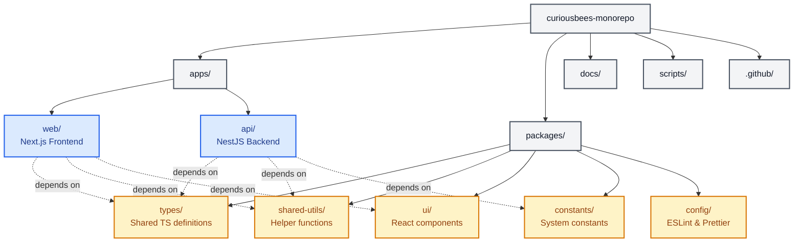

```mermaid
graph TD
    %% Root
    Root[curiousbees-monorepo]
    
    %% Apps
    Apps[apps/]
    AppWeb[web/ <br/> Next.js Frontend]
    AppApi[api/ <br/> NestJS Backend]
    
    %% Packages
    Packages[packages/]
    PkgTypes[types/ <br/> Shared TS definitions]
    PkgUtils[shared-utils/ <br/> Helper functions]
    PkgUI[ui/ <br/> React components]
    PkgConst[constants/ <br/> System constants]
    PkgConfig[config/ <br/> ESLint & Prettier]
    
    %% Others
    Docs[docs/]
    Scripts[scripts/]
    Github[.github/]
    
    %% Connections
    Root --> Apps
    Apps --> AppWeb
    Apps --> AppApi
    
    Root --> Packages
    Packages --> PkgTypes
    Packages --> PkgUtils
    Packages --> PkgUI
    Packages --> PkgConst
    Packages --> PkgConfig
    
    Root --> Docs
    Root --> Scripts
    Root --> Github
    
    %% Dependencies
    AppWeb -. depends on .-> PkgTypes
    AppWeb -. depends on .-> PkgUtils
    AppWeb -. depends on .-> PkgUI
    AppApi -. depends on .-> PkgTypes
    AppApi -. depends on .-> PkgUtils
    AppApi -. depends on .-> PkgConst

    %% Styling
    classDef folder fill:#F3F4F6,stroke:#4B5563,stroke-width:2px,color:#111827;
    classDef app fill:#DBEAFE,stroke:#2563EB,stroke-width:2px,color:#1E3A8A;
    classDef package fill:#FEF3C7,stroke:#D97706,stroke-width:2px,color:#92400E;
    
    class Root,Apps,Packages,Docs,Scripts,Github folder;
    class AppWeb,AppApi app;
    class PkgTypes,PkgUtils,PkgUI,PkgConst,PkgConfig package;
```
