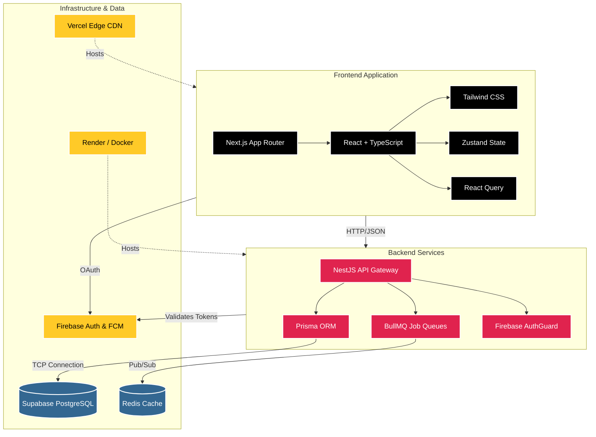

```mermaid
graph TD
    %% Frontend Subgraph
    subgraph Frontend [Frontend Application]
        Next[Next.js App Router]
        React[React + TypeScript]
        Tailwind[Tailwind CSS]
        Zustand[Zustand State]
        Query[React Query]
        Next --> React
        React --> Tailwind
        React --> Zustand
        React --> Query
    end

    %% Backend Subgraph
    subgraph Backend [Backend Services]
        Nest[NestJS API Gateway]
        Prisma[Prisma ORM]
        BullMQ[BullMQ Job Queues]
        AuthGuard[Firebase AuthGuard]
        Nest --> Prisma
        Nest --> BullMQ
        Nest --> AuthGuard
    end

    %% Infrastructure Subgraph
    subgraph Infrastructure [Infrastructure & Data]
        Supabase[(Supabase PostgreSQL)]
        Redis[(Redis Cache)]
        Firebase[Firebase Auth & FCM]
        Vercel[Vercel Edge CDN]
        Render[Render / Docker]
    end

    %% Connections
    Frontend -- HTTP/JSON --> Backend
    Frontend -- OAuth --> Firebase
    Backend -- Validates Tokens --> Firebase
    Prisma -- TCP Connection --> Supabase
    BullMQ -- Pub/Sub --> Redis
    Vercel -. Hosts .-> Frontend
    Render -. Hosts .-> Backend

    %% Styling
    classDef frontend fill:#000,stroke:#fff,stroke-width:2px,color:#fff;
    classDef backend fill:#E0234E,stroke:#fff,stroke-width:2px,color:#fff;
    classDef data fill:#336791,stroke:#fff,stroke-width:2px,color:#fff;
    classDef cloud fill:#FFCA28,stroke:#fff,stroke-width:2px,color:#000;

    class Next,React,Tailwind,Zustand,Query frontend;
    class Nest,Prisma,BullMQ,AuthGuard backend;
    class Supabase,Redis data;
    class Firebase,Vercel,Render cloud;
```
