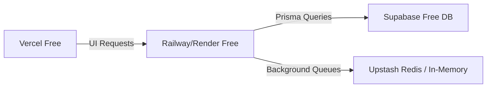

# CuriousBees V2 — Team Testing Deployment Guide

This guide describes how to deploy CuriousBees V2 to a free-tier hosting stack (Supabase, Railway, Vercel) so your team can open a URL and test all dashboards and modules immediately.

---

## 🏗️ Deployment Architecture



---

## 🛠️ Step-by-Step Deployment Instructions

### 1. Database Setup (Supabase Free Tier)

1. Create a free PostgreSQL project on [Supabase](https://supabase.com).
2. Retrieve your connection strings from **Settings > Database > Connection Strings**:
   * **Transaction Connection Pooler (port 6543)**: Set this as `DATABASE_URL` (ensure `?pgbouncer=true` is appended).
   * **Direct Connection (port 5432)**: Set this as `DIRECT_URL`.
3. Apply migrations and seed mockup database records locally:
   ```bash
   # Run migrations and seed data on the remote Supabase database
   npm run db:setup
   ```

### 2. Backend API Setup (Railway or Render Free Tier)

1. Create a service on [Railway](https://railway.app) or [Render](https://render.com) linking your GitHub repository.
2. Configure the deployment settings:
   * **Builder**: Select **Docker** (it will automatically pick up [Dockerfile.api](./Dockerfile.api) located in the monorepo root).
   * **Port**: Configure port mapping to `4000`.
3. Configure the following environment variables:
   ```env
   NODE_ENV=production
   PORT=4000
   DEVELOPMENT_MODE=true
   DATABASE_URL="your-supabase-transaction-pooler-url"
   DIRECT_URL="your-supabase-direct-connection-url"
   REDIS_URL="your-upstash-redis-url-if-used-otherwise-omit"
   FRONTEND_URL="https://your-frontend-project.vercel.app"
   NEXT_PUBLIC_API_URL="https://your-api-project.railway.app"
   ```

### 3. Frontend UI Setup (Vercel Free Tier)

1. Import your repository into [Vercel](https://vercel.app).
2. Configure project parameters:
   * **Framework Preset**: Next.js.
   * **Root Directory**: `apps/web`.
3. Configure the build environment variables:
   ```env
   NEXT_PUBLIC_API_URL="https://your-api-project.railway.app"
   NEXT_PUBLIC_DEVELOPMENT_MODE=true
   ```
4. Click **Deploy**. Vercel will build and distribute the Next.js portal.

---

## 👥 Teammate Testing Workflow

Once deployed, sharing and testing with your team is extremely simple:

1. **Open the App**: Provide the teammate with the Vercel URL (e.g., `https://curiousbees.vercel.app`).
2. **Access Portal**: The app opens directly without requiring Google or Firebase logins due to `NEXT_PUBLIC_DEVELOPMENT_MODE=true`.
3. **Switch Roles**: Use the **Dev Override Switcher** on the bottom-right corner of the page to switch roles dynamically (Research Scholar, Faculty Supervisor, or Institution Admin).
4. **Test Features**: Walk through:
   * **Scholar View**: Submit progress logs under `/reports`, view vacancies under `/opportunities`, log a DOI under `/publications`, or start discussions at `/threads`.
   * **Supervisor View**: Access supervisor controls at `/my-scholars` to grade reports, schedule notices, or post positions.
   * **Admin View**: Access settings at `/admin/users` or department catalogs at `/admin/departments`.
