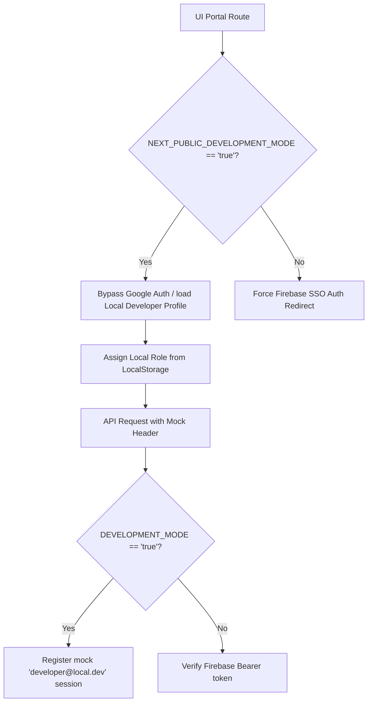

# CuriousBees V2 — Development Mode Stabilization Guide

This guide outlines how the **Development Mode Bypass (`DEVELOPMENT_MODE=true`)** is structured, configured, and maintained across all monorepo systems. It allows developers to work on features, dashboards, and APIs offline without configuring Firebase SSO or database synchronization.

---

## ⚙️ 1. Enabling Development Mode

Development Mode is active by default in the consolidated root environment configurations.

### Configuration (`/.env`)

Ensure the following flags are enabled:

```env
# Bypass NestJS API authentication guards
DEVELOPMENT_MODE=true

# Bypass Next.js route protection & enable role switcher
NEXT_PUBLIC_DEVELOPMENT_MODE=true
```

No sub-folder configuration files (such as `apps/web/.env.local` or `apps/api/.env`) are required.

---

## 🔑 2. How the Authentication Bypass Works



### A. Frontend Bypass Mechanics
* **Stores & State**: Bypasses the auto-redirect loops by checking if local storage overrides are active. 
* **Dynamic Role Switcher**: A switcher overlay appears at the bottom-right corner of the browser in development mode.
* **Token Bypass**: Selectable roles automatically map to corresponding mockup bearer headers:
  * **Research Scholar**: Sets token `mock-bypass-token-scholar`.
  * **Faculty Supervisor**: Sets token `mock-bypass-token-faculty`.
  * **Institution Admin**: Sets token `mock-bypass-token-admin`.

### B. Backend Bypass Mechanics
* **`FirebaseAuthGuard`**: Resolves execution contexts directly when `DEVELOPMENT_MODE=true`. It creates a mock user record containing:
  ```json
  {
    "id": "dev-user",
    "name": "Developer",
    "email": "developer@local.dev",
    "role": "RESEARCH_SCHOLAR",
    "approved": true,
    "status": "APPROVED",
    "department": "Development",
    "firebaseUid": "dev-uid"
  }
  ```
  *(The role parameter is dynamically assigned depending on the mock token format: `admin` $\rightarrow$ `INSTITUTION_ADMIN`, `faculty` $\rightarrow$ `RESEARCH_SUPERVISOR`)*.

---

## 🛠️ 3. Troubleshooting Loading Loops or Auto Logouts

If you encounter infinite loading spins, auto-logouts, or layout redirects:

1. **Clear Local Storage & Cookies**:
   Open browser dev tools console and run:
   ```javascript
   localStorage.clear();
   sessionStorage.clear();
   ```
2. **Re-select Role**:
   Refresh the page at `/login` or `/dashboard`. The switcher overlay will reappear at the bottom right. Select your preferred role to set the local storage token.
3. **Verify Doctor Diagnosis**:
   Run `npm run doctor` to check if your API and databases are reachable. If the backend is down, the frontend will experience loading lags.
